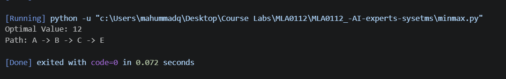
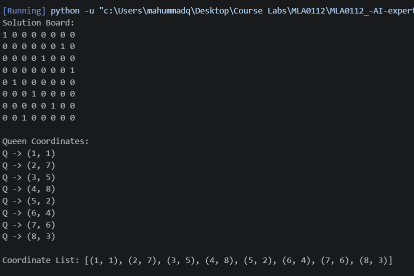
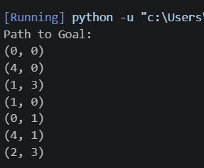
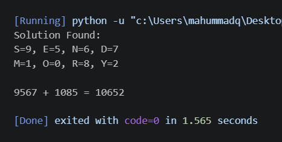
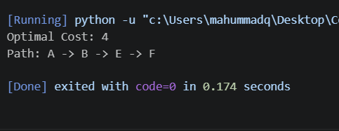
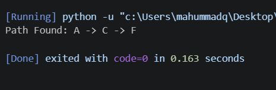
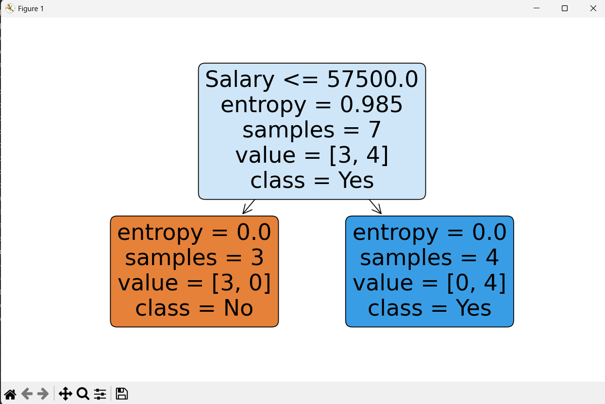
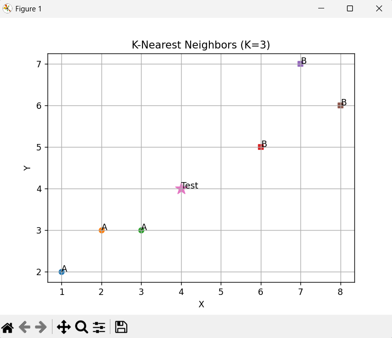
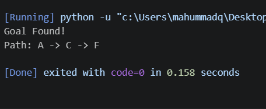
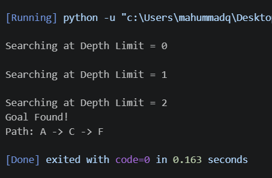

# Artificial Intelligence & Expert Systems Lab – Pseudocodes

## 1. Minimax Search Algorithm

```
MINIMAX(node, depth, isMax)

IF depth = maximum depth
    RETURN node value

IF isMax = TRUE
    best ← -∞
    FOR each child of node
        value ← MINIMAX(child, depth+1, FALSE)
        best ← MAX(best, value)
    RETURN best

ELSE
    best ← +∞
    FOR each child of node
        value ← MINIMAX(child, depth+1, TRUE)
        best ← MIN(best, value)
    RETURN best
```



---

## 2. 8-Queen Problem (Backtracking)

```
SOLVE(col)

IF col = N
    RETURN TRUE

FOR each row from 0 to N-1
    IF position(row, col) is SAFE
        Place Queen

        IF SOLVE(col+1)
            RETURN TRUE

        Remove Queen

RETURN FALSE
```

### Safe Check

```
IS_SAFE(row, col)

CHECK row on left side
CHECK upper diagonal
CHECK lower diagonal

IF no queen attacks
    RETURN TRUE
ELSE
    RETURN FALSE
```

---

## 3. Water Jug Problem (BFS)

```
WATER_JUG()

Initialize Queue with (0,0)
Mark visited states

WHILE Queue is not empty

    Remove front state

    IF goal reached
        RETURN solution path

    Generate all possible states:
        Fill Jug A
        Fill Jug B
        Empty Jug A
        Empty Jug B
        Pour A → B
        Pour B → A

    Add unvisited states to Queue
```

---

## 4. Cryptarithmetic Problem

```
FOR every possible digit assignment

    Assign digits to letters

    IF leading digit = 0
        CONTINUE

    Compute SEND
    Compute MORE
    Compute MONEY

    IF SEND + MORE = MONEY
        PRINT solution
        STOP
```

---

## 5. Uniform Cost Search (UCS)

```
UCS(start, goal)

Insert start node into Priority Queue

WHILE queue not empty

    Remove node with minimum cost

    IF node = goal
        RETURN path

    Expand neighbors

    Add neighbors with cumulative cost
```

---

## 6. A* Search Algorithm

```
A_STAR(start, goal)

Insert start node in Priority Queue

WHILE queue not empty

    Remove node with smallest f(n)

    IF goal reached
        RETURN path

    FOR each neighbor

        g = actual cost
        h = heuristic cost
        f = g + h

        Insert into queue
```

### Formula

```
f(n) = g(n) + h(n)
```

---

## 7. Greedy Best First Search

```
GBFS(start, goal)

Insert start node into Priority Queue

WHILE queue not empty

    Remove node with smallest heuristic

    IF goal reached
        RETURN path

    Add neighboring nodes
```

### Formula

```
f(n) = h(n)
```

---

## 8. Decision Tree

```
BUILD_TREE(dataset)

IF all records belong to same class
    RETURN leaf node

Select best attribute

Split dataset using attribute

FOR each subset
    BUILD_TREE(subset)

RETURN decision tree
```

---

## 9. K-Nearest Neighbors (KNN)

```
KNN(test_point, K)

Calculate distance from test point
to all training points

Sort distances

Select K nearest neighbors

Count class frequencies

RETURN majority class
```

### Distance Formula

```
d = √[(x2-x1)² + (y2-y1)²]
```

---

## 10. Depth Limited Search (DLS)

```
DLS(node, goal, limit)

IF node = goal
    RETURN TRUE

IF limit = 0
    RETURN FALSE

FOR each child

    IF DLS(child, goal, limit-1)
        RETURN TRUE

RETURN FALSE
```

---

## 11. Iterative Deepening Search (IDS)

```
IDS(start, goal)

FOR depth = 0 to maximum depth

    result = DLS(start, goal, depth)

    IF result = TRUE
        RETURN path

RETURN failure
```

---

# Complexity Summary

| Algorithm         | Time Complexity | Space Complexity |
| ----------------- | --------------- | ---------------- |
| Minimax           | O(b^d)          | O(d)             |
| 8 Queen           | O(N!)           | O(N²)            |
| Water Jug (BFS)   | O(V+E)          | O(V)             |
| Cryptarithmetic   | O(10!)          | O(1)             |
| UCS               | O(b^d)          | O(b^d)           |
| A*                | O(b^d)          | O(b^d)           |
| Greedy Best First | O(b^d)          | O(b^d)           |
| Decision Tree     | O(n log n)      | O(n)             |
| KNN               | O(n)            | O(1)             |
| DLS               | O(b^l)          | O(bl)            |
| IDS               | O(b^d)          | O(bd)            |

```
```
